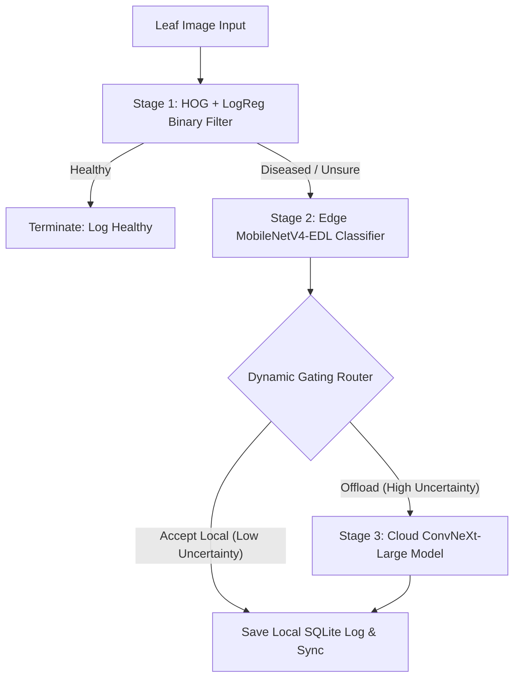

# Folia Crop Diagnostics

A production-ready, research-grade cooperative edge-cloud inference framework designed for reliable crop disease diagnostics in low-connectivity agricultural fields. 

---

## 1. System Architecture & Cooperative Inference Pipeline

The framework implements a hybrid, two-stage diagnostic pipeline designed to maximize classification accuracy while minimizing processing latency and cloud communication costs in remote fields.



### 1.1 Stage 1: Lightweight Binary Pre-Filter (Edge)
Runs locally on the edge node. A computationally cheap **HOG (Histogram of Oriented Gradients) + Logistic Regression** binary classifier checks if the leaves are completely healthy. If healthy, the diagnostic pipeline terminates immediately, avoiding complex neural network invocations.

### 1.2 Stage 2: Cooperative Multi-Class Diagnosis (Edge/Cloud)
For leaves flagged as diseased or questionable, the system initiates a cooperative inference protocol:

1. **Edge Classifier (MobileNetV4-EDL)**: Runs locally, utilizing an **Evidential Deep Learning (EDL)** head to predict the plant disease category across 88 classes.
2. **Epistemic Uncertainty Quantification (Vacuity)**: Instead of producing point probabilities using Softmax, the EDL head models outputs as Dirichlet parameters $\alpha_k = e_k + 1$, where $e_k = \text{softplus}(z_k)$ represents class evidence. The **epistemic uncertainty (vacuity)** is computed analytically as:
   $$u = \frac{K}{S}$$
   where $K = 88$ classes, and $S = \sum_{k=1}^K \alpha_k$ is the total Dirichlet strength.
3. **Conformal Confidence Scaling**: Validation scores are scaled using a Conformal Temperature Scaler ($T_{\text{conf}}$). The maximum calibrated probability is monitored:
   $$p_{\max}(x) = \max_{k} p(k \mid x)$$
4. **Latency-Aware Gating Router**: The router checks network latency ($L_{\text{WAN}}$) via heartbeats and dynamically updates the confidence gating threshold:
   $$\tau_{\text{conf}}(L_{\text{WAN}}) = \tau_{\text{base}} \cdot e^{-\beta \cdot L_{\text{WAN}}} + \tau_{\text{min}}$$
5. **Offloading Logic**: If the edge model is uncertain or the calibrated confidence is low, the image is offloaded to the cloud:
   $$\text{Offload} = (u > \tau_{\text{vac}}) \lor \left( p_{\max}(x) < \tau_{\text{conf}}(L_{\text{WAN}}) \right)$$
6. **Cloud Model (ConvNeXt-Large)**: Processes offloaded images on Hugging Face Spaces (Port 7860).
7. **Offline-First Storage**: Transaction logs are recorded locally to an offline-first SQLite database. When WAN connection is recovered, logs automatically sync back to the cloud database.

For complete mathematical derivations and proofs, please refer to the compiled research paper:
👉 **[model_report.pdf (Mathematical Report)](file:///home/anamitra/adaptive-edge-cloud-plant-diagnosis/training/model_report.pdf)**

---

## 2. Directory Layout

- `/training/`: Contains PyTorch model definitions, local test script, and the production Kaggle training code.
- `/backend/`: FastAPI server hosted on Hugging Face (port 7860) including Docker configurations and SQLite databases.
- `/frontend/`: Vite React application hosted on Vercel utilizing a dark glassmorphic telemetry dashboard.

---

## 3. Getting Started

### 3.1 Local Development
Run both the frontend and backend servers concurrently using the custom runner:
```bash
./run_local.sh
```

- **Backend URL**: `http://localhost:7860`
- **Frontend URL**: `http://localhost:5173`

To inspect execution outputs, view `backend/backend.log` and `frontend/frontend.log`.

---

## 4. Model Training (Kaggle)

The training pipeline consists of two models trained on Kaggle GPUs (`2*T4` or `1*P100`):

### 4.1 Edge Model (MobileNetV4-EDL + GRL Domain Adaptation)
This script trains the lightweight edge backbone and its evidential head.
- **Script**: `training/kaggle_training_script_edge.py`
- **Execution**:
  ```bash
  python3 kaggle_training_script_edge.py --epochs 25 --batch_size 64 --lr 0.001
  ```
- **Hugging Face Uploads**:
  - Automatically uploads checkpoint files `mobilenetv4_edge_epoch_{epoch}.pth` to repository `Arko007/adaptive-edge-plant-model` after every epoch.
  - Automatically uploads the best performing model to `mobilenetv4_edge_best.pth` and calibration parameters to `calibration_config.txt`.

### 4.2 Cloud Model (ConvNeXt-Large Classifier)
This script trains the heavy cloud classifier.
- **Script**: `training/kaggle_training_script_cloud.py`
- **Execution**:
  ```bash
  python3 kaggle_training_script_cloud.py --epochs 25 --batch_size 32 --lr 0.0001
  ```
- **Hugging Face Uploads**:
  - Automatically uploads checkpoint files `convnext_large_cloud_epoch_{epoch}.pth` to repository `Arko007/adaptive-cloud-plant-model` after every epoch.
  - Automatically uploads the best performing model to `convnext_large_cloud_best.pth`.

---

## 5. Deployment

### 5.1 Hugging Face Space Backend (Port 7860)
1. Create a new Space on Hugging Face, selecting **Docker** as the SDK.
2. Upload all files from `/backend/` (including `Dockerfile`, `app.py`, `database.py`, `models.py`, and `requirements.txt`).
3. Hugging Face will automatically build and expose the container on port 7860.

### 5.2 Vercel Frontend
1. Import the `/frontend/` folder to Vercel.
2. Configure the build command: `npm run build` and output directory: `dist`.
3. Deploy. The dashboard is fully static and communicates securely with the Hugging Face space backend using API Key verification.
